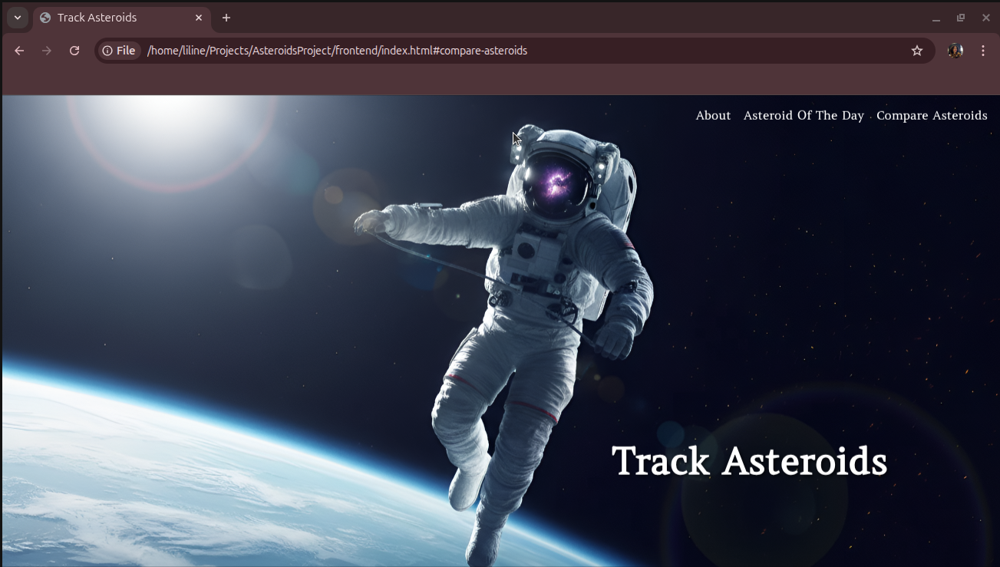
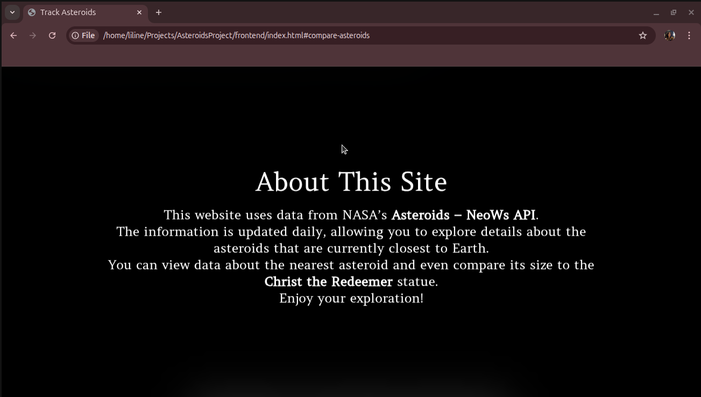
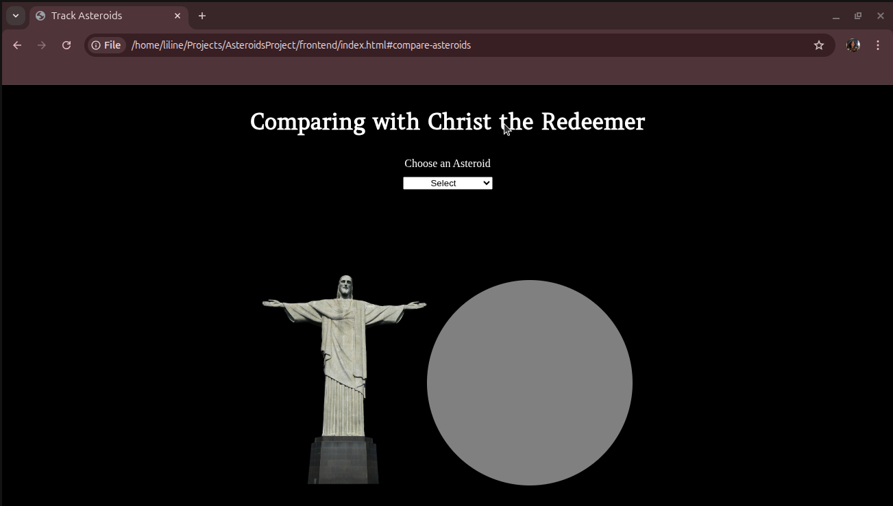
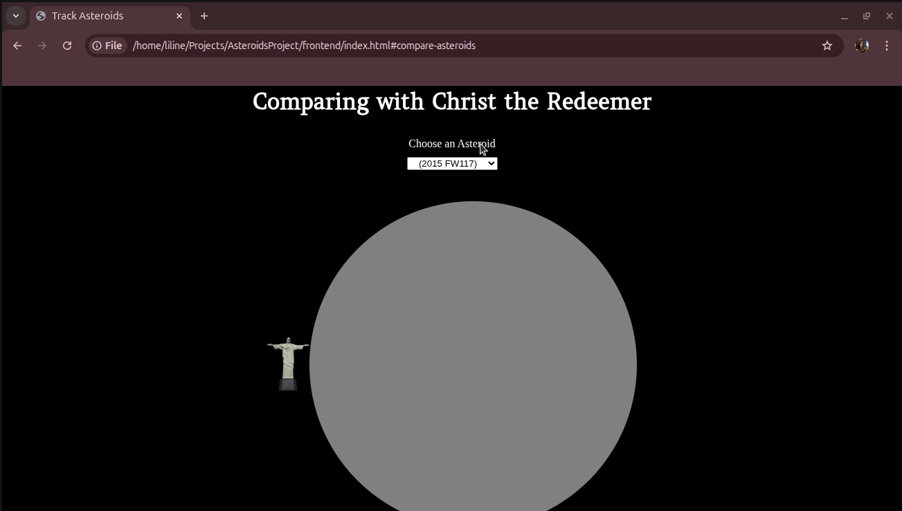
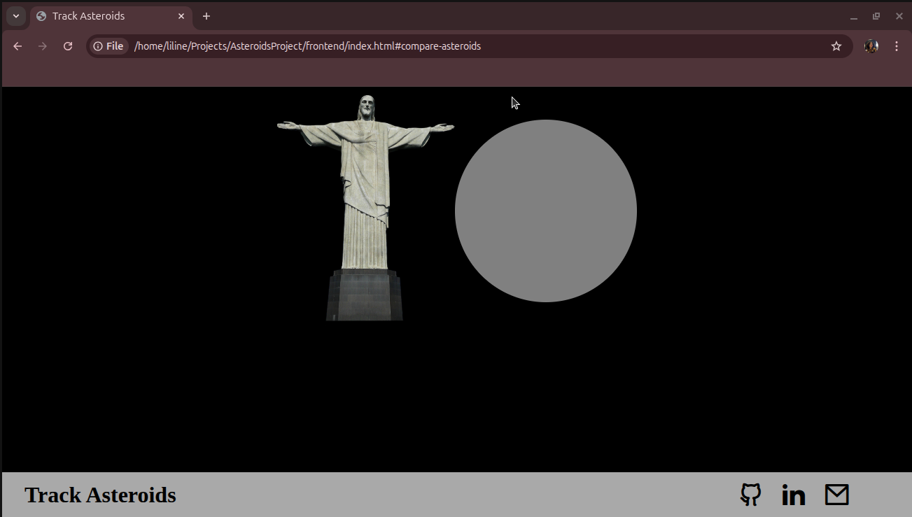
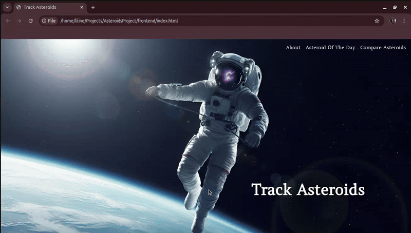

# 🚀 Track Asteroids

**Track Asteroids** is an interactive website built using the **Near Earth Object Web Service**, **FastAPI**, and **PostgreSQL**, designed to help you explore, visualize, and compare near-Earth objects.

With this project, you can:
- View the **nearest asteroid to Earth tracked today**.
- Explore **detailed data** about every asteroid tracked today.
- Compare asteroid sizes with **Christ the Redeemer**.

---

# 🌍 Let's Explore What We Have

## 🏠 Home Page
This page gives you easy access to all sections of the site:
- About  
- Asteroid of the Day  
- Compare Asteroids

---

## ☄️ Asteroid Page
This section provides a short introduction to the purpose of the project.

---

## ⭐ Asteroid of the Day
Scrolling down, you can find interesting information about the nearest asteroid to Earth tracked today.

---

## 🆚 Compare Asteroids
This feature allows you to compare all asteroids tracked today with Christ the Redeemer.  
Simply choose one from the list and explore the comparison.

---

## 👣 Footer
At the bottom of the page, you’ll find links to:
- My GitHub profile  
- LinkedIn  
- An email box to contact me  

---

# See it working

